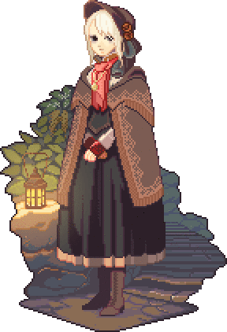
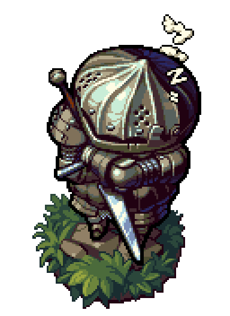

<!DOCTYPE html>
<html lang="en">
<head>
	<title>Marcos José</title>
	<meta charset="utf-8">
	<meta name="viewport" content="width=device-width, initial-scale=1, shrink-to-fit=no">
	<link href="https://fonts.googleapis.com/css?family=Gentium+Book+Basic|Libre+Baskerville" rel="stylesheet">
	<link rel="stylesheet" href="https://stackpath.bootstrapcdn.com/bootstrap/4.1.1/css/bootstrap.min.css" integrity="sha384-WskhaSGFgHYWDcbwN70/dfYBj47jz9qbsMId/iRN3ewGhXQFZCSftd1LZCfmhktB" crossorigin="anonymous">
	<link rel="stylesheet" type="text/css" href="css.css">
	<link rel="icon" href="media/flaticon/Soul_of_the_Lords.png">
</head>

<body>
	
	

		<a href="#sobreMim" class="active">Sobre Mim</a>
		<a href="#objetivos">Objetivos</a>
		<a href="#qualificações">Qualificações</a>
		<a href="#experiências">Experiências</a>
		<a href="#curiosidades">Curiosidades</a>
		<a href="javascript:void(0);" class="icon" onclick="myFunction()">
	    <i class="fa fa-bars"></i>
		</a>
	

	<button onclick="topFunction()" id="botao">Topo</button>
	
	

		<section id="sobreMim" class="row">
			

				Sobre Mim
			

			

				  
				Marcos José Pimentel Salles 
				17 anos 
				Nasci 12/07/2000 
				mjps240@gmail.com 
				(37)99985-3023 
				<!--  -->
				
				
			

			

				Sou Marcos José Pimentel Salles, estou cursando Ciência da Computação na 
				UFLA e sou Trainee da Comp. Júnior. Como quase todos do meu curso, gosto de 
				jogos, animes e séries.
				  
				Tenho interesse em desenvolver pesquisas na área de inteligência artificial,
				e também em dia me tornar um desenvolvedor de aplicativos e jogos.
			

		</section>
		<section id="objetivos" class="container">
			

			

				Objetivos
			

				

					

						
						 
						 
						 
						Entrar pra Comp. Jr., e
						ajudar no que for
						necessário
					

					

						
						 
						 
						 
						Me formar como
						programador
					

				

				

					

						
						 
						 
						 
						Ganhar experência para
						que eu possa fazer cada vez
						mais
					

					

						
						 
						 
						 
						Fazer ao menos um
						mangá, uma animação e
						um jogo
					

				

				

					
				

			

		</section>
		<section id="qualificações" class="row">
			

				Qualificações
			

			

				
			

			

				Cursei a primeira metade do Ensino Fundamental II no Colégio Dom
				Belchior, depois me transferi para o Colégio Losango, onde permaneci até a
				conclusão do Ensino Médio
				  
				Durante o período do início do Ensino Fundamental II até o segundo ano do 
				Ensino Médio, fiz um curso de Inglês no CCAA.
				  
				Logo após o término do Ensino Médio, eu já me engressei na UFLA, no curso 
				de Ciência da Computação, do qual eu sou calouro.
			

		</section>
		<section id="experiências" class="row">
			

				Experiências
			

			

				

					Detenho uma razoável experiência com programação em C++
				

				

					Tenho um breve conhecimento de Design
				

				

					Estou apendendo a programar em HTML/CSS
				

			

			

				
			

		</section>
		<section id="curiosidades" class="row">
			

				Curiosidades
			

			

				<h4>Jogos favoritos</h4>
				  
				Skyrim  
				Dark Souls  
				Dragon Quest8  
				Undertale  
				Paladins
			

			

				<h4>Mangás que gosto</h4>
				  
				Berserk  
				Fullmetal Alchemist  
				HunterXHunter  
				Nanatsu no Taizai  
				Goblin Slayer
			

			

				<h4>Webtoons</h4>
				  
				Unordinary  
				Bastard  
				Tower of God  
				God of Highschool  
				Dice
			

			

				<h4>Cartoons</h4>
				  
				Wakfu  
				Gumball  
				Adventure Time  
				Rick and Morty  
				Bravest Warriors
			

		</section>
	

</body>

</html>
